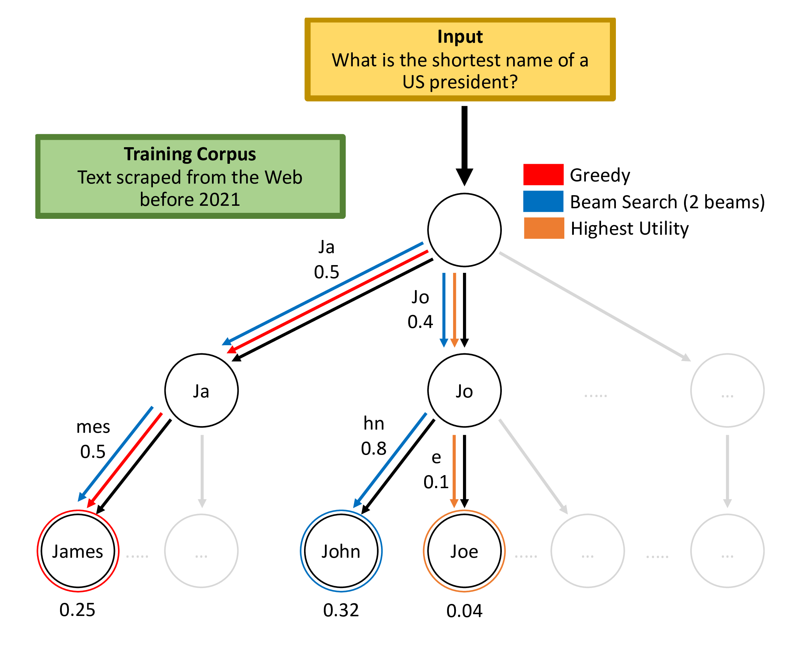

# Language Model Decoding as Likelihood-Utility Alignment

[](https://www.python.org/downloads/release/python-390/)
[](LICENSE)
[](https://arxiv.org/abs/2210.07228)

This repository contains the PyTorch implementation for the experiments in [Language Model Decoding as Likelihood-Utility Alignment](https://arxiv.org/abs/2210.07228). The codebase is built upon [PytorchLightning](https://www.pytorchlightning.ai/) and [Hydra](https://hydra.cc/).

```
@inproceedings{josifoski-etal-2023-language,
    title = "Language Model Decoding as Likelihood{--}Utility Alignment",
    author = "Josifoski, Martin  and
      Peyrard, Maxime  and
      Raji{\v{c}}, Frano  and
      Wei, Jiheng  and
      Paul, Debjit  and
      Hartmann, Valentin  and
      Patra, Barun  and
      Chaudhary, Vishrav  and
      Kiciman, Emre  and
      Faltings, Boi",
    booktitle = "Findings of the Association for Computational Linguistics: EACL 2023",
    month = may,
    year = "2023",
    address = "Dubrovnik, Croatia",
    publisher = "Association for Computational Linguistics",
    url = "https://aclanthology.org/2023.findings-eacl.107",
    pages = "1455--1470",
    abstract = "A critical component of a successful language generation pipeline is the decoding algorithm. However, the general principles that should guide the choice of a decoding algorithm remain unclear. Previous works only compare decoding algorithms in narrow scenarios, and their findings do not generalize across tasks. We argue that the misalignment between the model{'}s likelihood and the task-specific notion of utility is the key factor in understanding the effectiveness of decoding algorithms. To structure the discussion, we introduce a taxonomy of misalignment mitigation strategies (MMSs), providing a unifying view of decoding as a tool for alignment. The MMS taxonomy groups decoding algorithms based on their implicit assumptions about likelihood{--}utility misalignment, yielding general statements about their applicability across tasks. Specifically, by analyzing the correlation between the likelihood and the utility of predictions across a diverse set of tasks, we provide empirical evidence supporting the proposed taxonomy and a set of principles to structure reasoning when choosing a decoding algorithm. Crucially, our analysis is the first to relate likelihood-based decoding algorithms with algorithms that rely on external information, such as value-guided methods and prompting, and covers the most diverse set of tasks to date. Code, data, and models are available at https://github.com/epfl-dlab/understanding-decoding.",
}
```
**Please consider citing our work, if you found the provided resources useful.**<br>

---
## The Idea in a Nushell
A critical component of a successful language generation pipeline is the decoding algorithm. However, the general principles that should guide the choice of a decoding algorithm remain unclear. Previous works only compare decoding algorithms in narrow scenarios, and their findings do not generalize across tasks. 
We argue that the misalignment between the model's likelihood and the task-specific notion of utility is the key factor to understanding the effectiveness of decoding algorithms.
 
<div align="center">

</div>

To structure the discussion, we introduce a taxonomy of misalignment mitigation strategies (MMSs), providing a unifying view of decoding as a tool for alignment. The MMS taxonomy groups decoding algorithms based on their implicit assumptions about likelihood--utility misalignment, yielding general statements about their applicability across tasks. 
Specifically, by analyzing the correlation between the likelihood and the utility of predictions across a diverse set of tasks, we provide empirical evidence supporting the proposed taxonomy and a set of principles to structure reasoning when choosing a decoding algorithm. 
Crucially, our analysis is the first to relate likelihood-based decoding algorithms with algorithms that rely on external information, such as value-guided methods and prompting, and covers the most diverse set of tasks to date.

The goal of the proposed conceptual framework is to make a step toward enabling a more systematic study of decoding, and their relation with other MMS such as fine-tuning which do not address the problem at inference time. To further help the community investigate the broader space of tasks, models, and datasets through this lens, we open-source the implementation of our analysis, as well as the decoding algorithms (stochastic beams, value-guided beam search and monte carlo tree search) which are not (yet) implemented in the standard HuggingFace library.

## Setup Instructions

This codebase has been tested with the packages and versions specified in `requirements.yaml` and `pip_requirements.txt` and Python 3.8 on Manjaro Linux and Red Hat Enterprise Linux Server 7.7 (Maipo).

Start by cloning the repository and preparing the submodules:
```bash
git clone https://github.com/epfl-dlab/understanding-decoding.git
git submodule update --init --recursive
```

### 1. Environment Setup

#### Virtual Environment
With the repository cloned and submodules updated, we recommend creating a new [conda](https://docs.conda.io/en/latest/) virtual environment:
```bash
conda env create -n understanding-decoding --file=requirements.yaml
conda activate understanding-decoding
```

Then, install [PyTorch](https://pytorch.org/) 1.8.0. For example using pip and with CUDA 11 support:
```bash
pip install torch==1.8.0+cu111 torchvision==0.9.0+cu111 torchaudio==0.8.0 -f https://download.pytorch.org/whl/torch_stable.html
```

Install the remaining packages using pip:
```bash
pip install -r pip_requirements.txt
```
and `pygraphviz` from conda using conda:
```
conda install -c conda-forge pygraphviz==1.9
```

Finally, make sure to add the following directories to your Python path:
```bash
export PYTHONPATH="$PYTHONPATH:$PWD"
export PYTHONPATH="$PYTHONPATH:$PWD/transformers/src"
export PYTHONPATH="$PYTHONPATH:$PWD/mctx"
```
Note that you have to re-do this each time you create a new shell session (or create an init script that you will source). 

#### Docker Container
Alternatively you can build and run a docker container from the Dockerfile provided in the root repository. You still need to include the directories in your Python path as described above.

### 2. Downloading the Data and Models

To download and prepare the data, execute the following:
```bash
bash download_data.sh data
python scripts/get_genie_ckpt.py --input_ckpt_dir data/models --output_ckpt_dir data/models --ckpt_name genie_genre_r.ckpt
```

## Usage

In a nutshell, every experiment run is following 3 steps:

1. **Inference**: Generate the predictions using a specific decoding algorithm
2. **Computing Performance**: Compute the evaluation metrics on the generated predictions
3. **Visualizing the Performance**: Visualize the performance of the decoding algorithm 

### 1. Inference

Each of the experiments is associated with a task and a model (i.e., an evaluation setting), and a decoding algorithm. For instance, to run the inference for a specific experiment, call:

```
DECODING_ALGORITHM="beam_search"  # greedy_search, stochastic beams, pplmcts, value_guided_beam_search, etc.

# The following two parameters should be compatible with each other
EVALUATION_SETTING="mbart_translation"  # gpt2_toxicgen, genie_cie_large, protgpt2_design
MODEL_SPECIFIC_DECODING_PARAMETERS="mbart_generic"  #  gpt_generic, genie_generic, protgpt2_generic

python -m run_evaluation.py evaluation=$EVALUATION_SETTING \
                            model/decoding=[$MODEL_SPECIFIC_DECODING_PARAMETERS,$DECODING_ALGORITHM]
```

This makes it very easy to extend our experiments to new tasks and run inference with any HuggingFace model and decoding algorithm, as well as [MCTS](https://aclanthology.org/2022.naacl-main.215/) or [VGBS](https://proceedings.neurips.cc/paper/2017/file/2b24d495052a8ce66358eb576b8912c8-Paper.pdf) which are not (yet) implemented in the standard HuggingFace library. 

See the content of the [scripts/launchers](scripts/launchers) directory for more examples on how to start multi-gpu and multithreaded runs.

To reproduce the inference runs for the experiments in the paper execute the scripts in the [scripts/launchers](scripts/launchers) directory. 

### 2. Computing Performance

To compute the performance for an inference run from the generated predictions you need to specify the path to the wandb directory corresponding to the run and the corresponding evaluation setting:

```
EVALUATION_SETTING="translation"  # toxicity, cie, solubility

WANDB_RUN_PATH="epfl-dlab/understanding-decoding/3410qxd0" 

python -m run_evaluation_from_file --wandb_run_path $WANDB_RUN_PATH \ 
                                   --overrides evaluation_from_file=$EVALUATION_SETTING
```

The [launch_evaluation_from_file.sh](scripts/launch_evaluation_from_file.sh) script contains all the evaulation_from_file calls for the experiments in the paper. The RQ3 experiment results were exceptionally evaluated by (1) running `python scripts/visualise_figure5.py --parse_dataset` to create intermediary results, and (2) post-processing the intermediary results by hand to get cleaned model's predictions.

### 3. Visualizing the Performance

The plotting utilities used for generating the plots in the paper are in the [scripts](scripts) directory. The exact commands used to generate Figures 2-5 in the paper are provided in the [scripts/plotting](scripts/plotting) directory. 

## Experiment Logs & Predictions

To support future research, we provide full access to the experiment parameters, inference logs, and the raw predictions for all the experiments in the project's Weights & Biases [repository](https://wandb.ai/epfl-dlab/understanding-decoding).
For each of the experiments in the repository, the results are in the <code>results.json</code> file, while the predictions are in the <code>testing_output</code> directory.

For an example on how to access this data see the following [notebook](notebooks/experiment_logs.ipynb).

## Credits

The implementation was developed by: 

Martin Josifoski*, Frano Rajic*, Jiheng Wei^, Maxime Peyrard^, Debjit Paul^ <br>

&#42; and ^  indicate equal contribution.

## License

Distributed under the MIT License. See [LICENSE](LICENSE) for more information.
